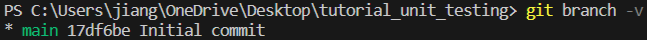
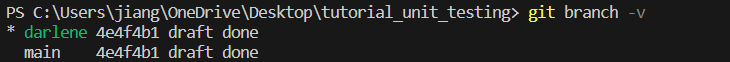

# tutorial_unit_testing

## Task 1: Make your own branch

To check what branches you have 

    git branch -v

You should see that you are on **main** branch with highlights on it

To create your own branch with your \[NAME\] and enter it

    git checkout -b [NAME]

Using following command again to double check if your branch is now changed to the new branch

    git branch -v

You should see something like this (example name: darlene)

## Task 2: Make the change on code

Now your are ready to make you changes on your code

First, make the designated change on your code following the instruction in *code.c*

[code picture]

Second, upload the code piece to your own branch following the add, commit and push sequence that we learnt before

    git add *
    git commit -am "updated by [NAME]"
    git push -upstream origin [NAME]

Finally, you should see this following text printed out on your terminal

[picture]

## Task 3: Merge branch && Approve others

Now your branch is all updated, you are ready to make a final update to main branch!

First, go back to your main branch by using the following command

    git checkout main

Then, make sure you are actually back by using

    git branch -v

Note: Try to do a *pull* action now to make sure that your local main branch is still updated. If your local main branch is no longer the updated version, your following action will **FAIL** or getting very comlicated!!!!

Now your are ready to merge!! You will perform a *pull* action on the main branch to your [NAME] branch

You will see the following screen printed

[picture]

You will resolve all the conflicts by preserve all the edits and delete the marks like the following

[picture]

Now you are good to go! Go ahead to make the commit and upload by add, commit and push!

    git add *
    git commit -am "merged by [NAME]"
    git push -upstream origin main

You should now see the following print outs. It means you are ready to get approved!

[picture]

Ask your assigned person to approve your code![link] DON'T CHEAT! We can trace your approval history and comments by the commits history below

[picture]

Don't forget to approve other people's code as well! Just click the button and write your comments. Your will need to approve **AT LEAST ONE** person in this team.